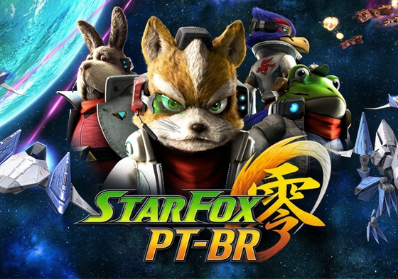

# Star Fox Zero - Tradução PT-BR

<<<<<<< HEAD
Projeto de tradução completa do jogo.

---

## 📊 Progresso da Tradução

=======
>>>>>>> 5d50633a6fa48da9ab285d344eaa388cb77d8232
<!-- PROGRESS_START -->
<!-- PROGRESS_END -->

## 📥 Downloads

### ...

<p align="center">
  
</p>

## 🔹 Sobre a Tradução

A tradução está sendo desenvolvida a partir dos arquivos originais em espanhol e adaptada para o português brasileiro. Essa abordagem foi adotada devido a limitações e à ausência de alguns caracteres do nosso alfabeto nos demais idiomas disponíveis do jogo.

## 🔹 Objetivo do Projeto

Este projeto tem como objetivo permitir que mais jogadores brasileiros possam compreender melhor a história e a experiência de **Metroid Prime Remastered**.
Caso encontre erros de tradução, ortografia ou inconsistências durante o jogo, seu feedback será muito bem-vindo e ajudará a melhorar ainda mais o projeto.

## 🔹 Requisitos

* Nintendo Wii U
* Emulador Cemu

## 🔹 Instalação

### ...

## 🔹 Ferramentas Utilizadas

* Visual Studio Code

## 🔹 Apoie o Projeto

Se desejar apoiar futuros projetos e traduções:

### PIX

```text
gilson.gbj@gmail.com
```

[](https://picpay.me/gilsongbj)

## ❤️ Agradecimentos
Obrigado a todos que acompanharam, testaram e contribuíram com este projeto.

Bom jogo!

